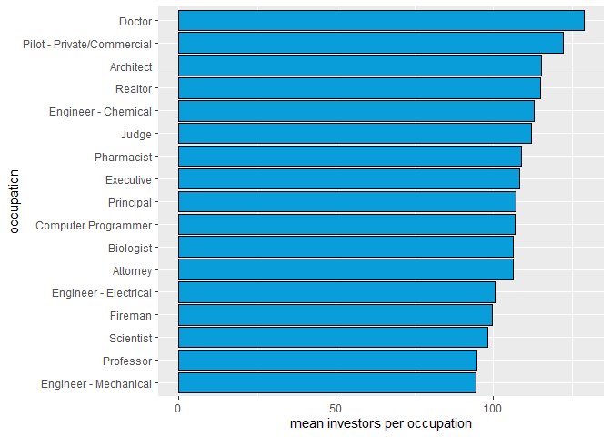

# Prosper Loan Analysis by Matthew Dolder

Reference:
<https://www.nerdwallet.com/reviews/loans/personal-loans/prosper-personal-loans>

Prosper is peer-to-peer lending institution. Borrowers apply for loans
much like a bank loan and any number of people can invest in the loan
expecting a return.

Looking at the csv file, I noticed a wide range in the number of
investors.

Investors  
Min. : 1.00  
1st Qu.: 2.00  
Median : 44.00  
Mean : 80.48  
3rd Qu.: 115.00  
Max. :1189.00

Why do some loans attract so many investors while many, over 27,800
attract only 1 investor? Are investors looking for high risk loans which
pay a higher APR? Are they looking for low risk loans? Are the
motivations even financial? Perhaps they want to support teachers,
nurses, and fireman to feel they are doing a service to the community.
Perhaps they favor homeowners.  
Perhaps it’s simply the length of time since the loan was created,
giving more time for investors to jump on board.

# Univariate Plots Section

    ## [1] 113937

    ##    Investors        Occupation        DebtToIncomeRatio  ProsperScore  
    ##  Min.   :   1.00   Length:113937      Min.   : 0.000    Min.   : 1.00  
    ##  1st Qu.:   2.00   Class :character   1st Qu.: 0.140    1st Qu.: 4.00  
    ##  Median :  44.00   Mode  :character   Median : 0.220    Median : 6.00  
    ##  Mean   :  80.48                      Mean   : 0.276    Mean   : 5.95  
    ##  3rd Qu.: 115.00                      3rd Qu.: 0.320    3rd Qu.: 8.00  
    ##  Max.   :1189.00                      Max.   :10.010    Max.   :11.00  
    ##                                       NA's   :8554      NA's   :29084  
    ##  LoanOriginalAmount      Term        LoanStatus        ListingCreationDate
    ##  Min.   : 1000      Min.   :12.00   Length:113937      Length:113937      
    ##  1st Qu.: 4000      1st Qu.:36.00   Class :character   Class :character   
    ##  Median : 6500      Median :36.00   Mode  :character   Mode  :character   
    ##  Mean   : 8337      Mean   :40.83                                         
    ##  3rd Qu.:12000      3rd Qu.:36.00                                         
    ##  Max.   :35000      Max.   :60.00                                         
    ##                                                                           
    ##  LoanMonthsSinceOrigination TotalProsperLoans  BorrowerAPR     
    ##  Min.   :  0.0              Min.   :0.00      Min.   :0.00653  
    ##  1st Qu.:  6.0              1st Qu.:1.00      1st Qu.:0.15629  
    ##  Median : 21.0              Median :1.00      Median :0.20976  
    ##  Mean   : 31.9              Mean   :1.42      Mean   :0.21883  
    ##  3rd Qu.: 65.0              3rd Qu.:2.00      3rd Qu.:0.28381  
    ##  Max.   :100.0              Max.   :8.00      Max.   :0.51229  
    ##                             NA's   :91852     NA's   :25       
    ##  CreditScoreRangeUpper IsBorrowerHomeowner EmploymentStatus  
    ##  Min.   : 19.0         Mode :logical       Length:113937     
    ##  1st Qu.:679.0         FALSE:56459         Class :character  
    ##  Median :699.0         TRUE :57478         Mode  :character  
    ##  Mean   :704.6                                               
    ##  3rd Qu.:739.0                                               
    ##  Max.   :899.0                                               
    ##  NA's   :591

Figure 1. Histogram of the Investor variable.

This graph is capped at 400 investors. The max number of investors for a
single loan is 1,189. The graph shows that most loans have 1 investor
only.

Figure 2. Number of Loans by Occupation. Figure 3. Number of Loans by
employment status where Occupation = “Other”

Figure 2 shows that “Other” is the most popular occupation. This isn’t
very helpful for analysis. Figure 3 shows that for loans where
occupation is other, we can tease more information from the employment
status such as “self-employed” or “retired”.

Figure 4. Loan count by Debt to Income Ration

This graph shows that Prosper has a preference towards borrowers with a
Debt to Income ratio between 0.1 and 0.3.

Figure 5. Loan count by Prosper score.

Prosper score is the result of risk formula applied to loans starting in
2009. Loans originating prior to 2009 show as “NA”.

Figure 6. Loan count by Amount in Dollars.

Few loans are above $25,000.

Figure 7. Loan count by Term (length of loan)

36 months is the most popular term.

Figure 8. Loan count by Status.

Current and Complete are the most popular categories.

Figure 9. Loans issued by year.

The dataset begins in November 2005, hence the small number there.  
In 2009 changes in banking regulations due to the recession clearly had
an affect.  
Prosper has grown considerably since. The data set ends in March 2014.

Figure 10. Number of loans by months since origination.

This is a strange variable because the months keep counting up after the
loan is complete.

Figure 11. Number of loans by ‘total prosper loans’

The TotalProsperLoans variable is the number of Prosper loans the
borrower previously had. My assumption is that preference is given to
repeat customers.  
The majority of loans are first time borrowers.

Figure 12. Number of loans by APR

Generally, a higher APR is given to loans with a higher risk and can
also leads to a higher return.

Figure 13. Number of investors where debt to income ratio is 10.01

I found it interesting that anyone would invest in a loan with such a
high debt to income ratio.

# Univariate Analysis

### What is the structure of your dataset?

The dataset contains 80 variables and nearly 114,000 observations.  
The variables describe the terms of the loan, the repayment status, and
the financial health of the borrower.

### What is/are the main feature(s) of interest in your dataset?

I’m interested in information about the borrower or the loan which
influences investors to choose a loan.

### What other features in the dataset do you think will help support your

The data spans the 2008 recession. Comparing loans before and after may
show a shift in investor’s behavior or even a change lending
regulations. Prosper Score was added in 2009 as a result of the
recession and new regulations. Does this impact the number of investors?

### Did you create any new variables from existing variables in the dataset?

ListingCreationYear: Contains year parsed from ListingCreationDate
months_active: Number of months since loan was created, but capped at
the term of the loan.

# Bivariate Plots Section

What attracts investors to loans? Are they choosing wisely? Loan Status
vs Investor count could show us if they are choosing wisely.  
Do loans in default have a high number of investors?

Debt to income ratio (DTI) looks interesting. The population of total
loans are grouped around a seemingly low DTI with a few at the high end.
In the bivariate plots section, I want to compare investors to DTI and
see if the number of investors has a similar graph as the total number
of loans or if investors are disproportionately flocking toward
borrowers with a higher risk.

I’m also interested in investors per year because the data spans a
period both before and after the 2008 recession. Were investors careless
before 2008 and more conservative after?

Does occupation impact the number of investors? Perhaps they aren’t
choosing based on calculations, but instead feel a need to support
teachers.

I’m not as interested in Prosper score as there is no data prior to
2009.

Figure 14. Investors by Loan Status

This graph shows the total number of investors by loan status. Status of
“Current” has the most number of loans so the top graph is not
surprising.  
Looking at the mean investors per status, we can see loans which
performed poorly can have many investors per loan.

    ##    Min. 1st Qu.  Median    Mean 3rd Qu.    Max. 
    ##   38.64   64.74   77.96   80.64   93.66  128.79

Figure 15. Mean number of investors per occupation

This graph shows the occupation of borrowers which investors are most
interested in. Looking at this alone, we can’t tell if investors are
choosing by occupation or if these occupations just happen to have the
best credit score.

    ##    Min. 1st Qu.  Median    Mean 3rd Qu.    Max.    NA's 
    ##   637.8   693.1   704.6   704.0   717.7   744.5       3

Figure 16. Mean credit score by occupation

This graph shows the 18 occupations where borrowers have the highest
mean credit score. The different in credit score between each one is
trivial. What is interesting is the overlap of occupations with Figure
15.  
With a few exceptions, such as Fireman and Military Officer, the
occupations with the highest mean number of investors also have the
highest mean credit score.

Figure 17. Number of investors by credit score where credit score is
above 400 and number of investors is greater than 0 and less than 1000.

This graph shows a high concentration of loans and investors around the
750 credit score mark. Few loans have a very high number of investors
and few have a credit score below 500.

I would expect this graph to be the most dense at the top of the credit
score range. My guess is that few people have a perfect score and very
few of those people are interested in borrowing money from Prosper.

Figure 18. Number of investors by months active.

Months active is a custom variable which shows takes the number of
months since loan origination and caps it at the term of the loan. I
wanted to see if more investors jump on board a loan as time goes on. It
appears that is not the case, however, there is a higher concentration
of investors at 12 & 36 months which are popular term lengths.

Figure 19. Number of investors by debt to income ratio.

This graph shows that out of the entire population of loans, investment
is heavy below 0.1 debt to income. It also shows an unusual outlier at
the top end of debt to income ratio. These are loans where debt to
income is greater than 100%. Why would anyone invest in such risky
loans? Perhaps there is another factor such as occupation.

Figure 20. Number of investors by occupation where debt to income ratio
= 10.01

Figure 20 expands on Figure 19 by looking at borrowers with a maximum
debt to income ratio. Unfortunately, the largest category by far is
“other”. This doesn’t tell us much about the borrower.

Figure 21. Investors by employment status where debt to income ratio =
10.01 and occupation = “Other”

Figure 21 expands on Figure 19 & 20 by breaking down the other category
into employment status. Here we can see investors are drawn to
self-employed borrowers with a high debt to income. My assumption is
that these are business loans and investors are taking a chance on a
business idea.

Could homeowner status also have an impact on these high risk loans?

Figure 22. Investors by homeowner status for high risk loans and all
loans.

Figure 22 shows that high risk loans given to homeowners have a higher
proportion of investors than the entire population of loans. However in
both cases that Prosper lending system favors homeowners.

Expanding more on Figure 19. Number of investors by debt to income ratio
The population is so heavy in the 0 - 0.1 range, that zooming in may
shed some light.

    ## `geom_smooth()` using method = 'gam' and formula 'y ~ s(x, bs = "cs")'

    ## `geom_smooth()` using method = 'loess' and formula 'y ~ x'

Figure 23. Debt to income ratio by number of investors Figure 24. Debt
to income ratio by number of investors for 90% of loans.

Figure 23 & 24 show that Prosper and investors favor borrowers with a
debt to income of 0.6 or less.

# Bivariate Analysis

### Talk about some of the relationships you observed in this part of the 

investigation. How did the feature(s) of interest vary with other
features in  
the dataset?

I found that investors weren’t drawn to a particular loan status.

They do seem to be drawn to particular professions, but for the most
part those professions also have high credit scores. Doctor, Judge,
Pharmacist, Pilot, Computer Programmer, Professors, Scientist, are
examples of professions which both have a high number of investors and a
high credit score. Perhaps more interesting is Fireman which shows on
the list of top investors, but not on the list of top credit scores.

There does appear to be a correlation between number of investors and
credit score which is not surprising. Looking at Debt to Income Ratio
(DTI), Investors have a strong bias for low DTI, which also is not
surprising.  
However, I was very surprised to see a spike at the extreme high end of
DTI.  
According to the documentation, 10.01 is a cap for DTI and it represents
more than 100% debt to income. I would assume these borrowers have no
chance of paying back the loan and should not have any investors.

I zoomed into the data to look at those occupations which have extremely
high DTI and found the majority to be self-employed. I believe these are
business loans and the investors must be interested in taking a risk on
a business idea. I can’t tell from the documentation if the investors
get to see a business plan before choosing a loan or if they have to
choose based solely on borrower’s statisticss.

Finally, I found a large difference between investors choosing
homeowners over non-homeowners. One assumption that can be made, at
least in the United States, is that homeowners tend to be a bit older
and more established.  
According to nerdwallet.com, prosper loans are very popular for home
improvement loans which could be another explanation.  
Perhaps these two factors compound to make such a striking difference. A
another possibility is that the housing bubble pre-2009 lead to a frenzy
of home equity loans and investors.

### Did you observe any interesting relationships between the other features 

(not the main feature(s) of interest)?

### What was the strongest relationship you found?

Number of total investors by home ownership status.

# Multivariate Plots Section

Figure 25. mean investors per year for normal and high risk loans

This graph shows the number of investors per year. It is split into two
parts, those which are regular borrowers (below max debt to income
ratio) and those which are high risk borrowers (all debt and no income).
The graph also shows in text the percentage of total loans which are to
regular borrowers.

The purpose is to show a feeding frenzy of investors looking for high
risk investments leading up to the recession. However, this graph
doesn’t fit the narrative. Loans and Investors rise quickly after the
recession and the percentage of loans to borrowers with 100% debt to
income is so tiny that it barely shows on this scale.

We saw in previous graphs some speculators going after high risk loans
of self-employed borrowers, but that is clearly a rare occurrence.

    ## `geom_smooth()` using method = 'gam' and formula 'y ~ s(x, bs = "cs")'

Figure 26. Investors by debt to income ration and homeowner status.

This graph shows a preference for a borrower with debt to income ratio
between 1.5 and 2.5 and is a homeowner.

Figure 27. Debt to Income and Credit Score by Prosper score.

This graph shows that with the introduction of the Prosper score in
2009, risk assessment continued to use debt to income ratio and credit
score as a factor. The two variables (credit score and debt to income)
follow nearly identical patterns when compared to Prosper score.

# Multivariate Analysis

### Talk about some of the relationships you observed in this part of the 

investigation. Were there features that strengthened each other in terms
of  
looking at your feature(s) of interest?

Looking at investors by debt to income ratio and investors per year
investing in high risk loans, I came to the conclusion that Prosper
investors are by and large looking for a safe investment, not wild
speculation. There are a few exceptions, but those loans are less than
1% of the population.

The introduction of Prosper score in 2009 supports that analysis by
prosper giving a better score to borrowers with a high credit score and
high debt to income ratio.

### Were there any interesting or surprising interactions between features?

I was surprised by the consistency for investors to favor homeowners
across the entire range of debt to income. That can’t be by chance.
Another variable must be influenced by home owner status which is in
turn influencing the number of loans created and the number of
investors. .

### OPTIONAL: Did you create any models with your dataset? Discuss the 

strengths and limitations of your model.

------------------------------------------------------------------------

# Final Plots and Summary

### Plot One

### Description One

I chose the breakdown of investors per year split into regular and
maximum debt to income ratio. We showed earlier how a few high risk
loans can attract a massive number of investors, however, this is
clearly not the norm.  
It would be interesting to draw this same graph with data leading up to
present day and see if the trend continues. It would also be interesting
to have rolling datato see when investors get on board with a loan. When
a loan reaches some critical mass of investors, do others simply follow
the herd?

### Plot Two

    ## `geom_smooth()` using method = 'gam' and formula 'y ~ s(x, bs = "cs")'

### Description Two

For plot 2, I chose to show debt to income ratio vs investors for
borrowers with a DTI of 0.6 or less, separated by homeowner status.  
I chose 0.6 because 90% of all loans fall within this range. This graph
shows that both prosper and investors are attracted to borrowers with a
certain range of debt to income between 0.15 and 0.2. This shows
investors are looking for a safe investment.

We don’t have data for individual investors. Therefore, if a single
investor invests in multiple loans, he or she is counted many times. It
would be interesting to know about the investor. Could we then predict
which investors go after which type of loans? Could we gain insights
into how to market to low and high risk investors differently to attract
more?

### Plot Three

### Description Three

Finally, we see that the prosper score is related to both debt to income
ratio and credit score. The higher the prosper score, the lower the
risk. Prosper is using this score to advise investors. Therefore, going
forward with more recent data, we should be able to predict the number
of investors based on the prosper score more so than other factors such
as occupation.

------------------------------------------------------------------------

# Reflection

Investors are looking for a safe return on investment with the exception
of a very small number of high risk loans.  
We don’t know the amount that each investor put toward each loan and we
don’t know the number of distinct investors. Prosper score was added
after the 2008 recession for the purpose of guiding investors and is
using at least some of the same variables which investors were using
individually prior to 2009.

Future work could look into whether or not investors are choosing
wisely.  
The fields preceeded with “LP\_” - LP_CustomerPayments -
LP_CustomerPrincipalPayments - LP_InterestandFees - LP_ServiceFees -
LP_CollectionFees - LP_GrossPrincipalLoss - LP_NetPrincipalLoss -
LP_NonPrincipalRecoverypayments Could be analyzed to determine if
investors are getting a strong return and which investors experienced
opportunity cost by investing in the wrong loans. Compared the market in
general, is Prosper a good choice for their portfolio?

With more information about the small number of high risk loans and the
investors attracted to them, we could determine which high risk loans,
if any, future investors should consider.

# References:

<https://www.nerdwallet.com/reviews/loans/personal-loans/prosper-personal-loans>

<https://discuss.analyticsvidhya.com/t/how-to-count-number-of-distinct-values-in-a-column-of-a-data-table-in-r/1124/2>

<https://stackoverflow.com/questions/50935857/ggplot2-keeps-adding-5-at-end-of-year-variable-on-x-axis>

<https://www.roelpeters.be/scale-ggplot-y-axis-millions-or-thousands-r/>
